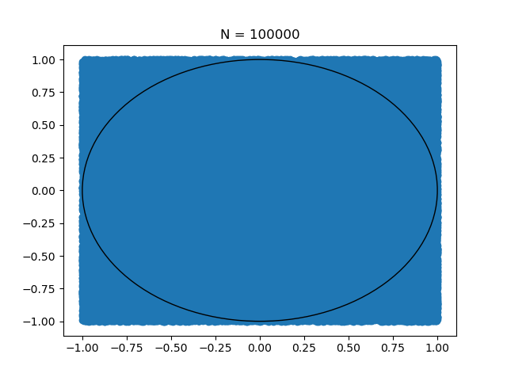

A fun challenge involving mathematics. Very creative.

The following are example plots of how the value was calculated.

## Plot 1: N = 10
Estimated value of pi = 2.8

## Plot 2: N = 100
Estimated value of pi = 2.96

## Plot 3: N = 1000
Estimated value of pi = 3.1

## Plot 4: N = 10000
Estimated value of pi = 3.15

## Plot 5: N = 100000
Estimated value of pi = 3.14192

